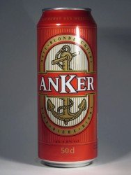
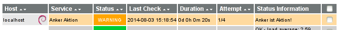

Anker Aktion
============

Ein kleines Python-Script um uns zu benachrichtigen, wenn das Ankerbier im Coop
oder Denner gerade zum halben Preis erhältlich ist.

Usage
-----

    $ python3 aktion.py

Wenn das Ankerbier Aktion ist, ist der Rückgabewert 0, ansonsten 1.

Nagios / Icinga Monitoring Integration
--------------------------------------

Neuen `command` definieren:

    define command {
       command_name    check_anker_aktion
       command_line    /usr/local/lib/nagios/plugins/aktion.py && exit 1 || exit 0
    }

Neuen `service` definieren und einem Host zuordnen:

    define service {
        use                    generic-service
        host_name              localhost
        service_description    Anker Aktion
        check_interval         720 ; Check twice a day
        retry_interval         120 ; Check every 2h if action
        check_command          check_anker_aktion
    }

Verpasse keine Aktion mehr:

License
-------

Public Domain.
